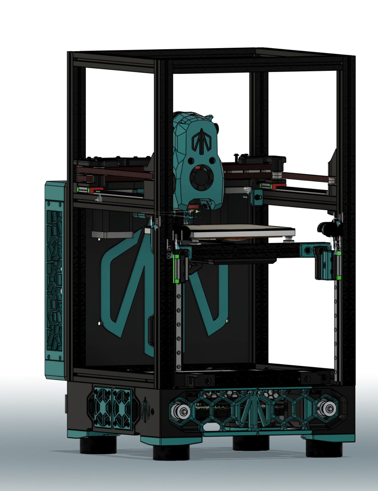
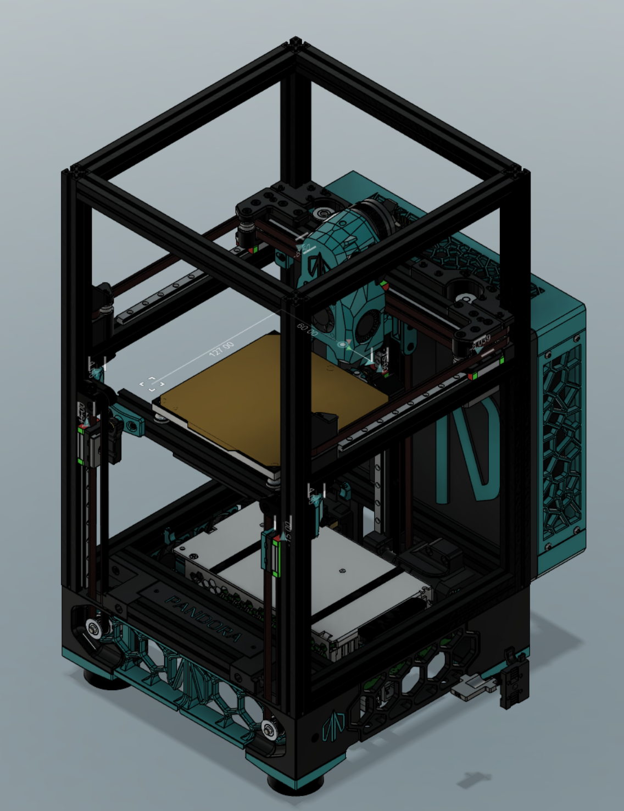
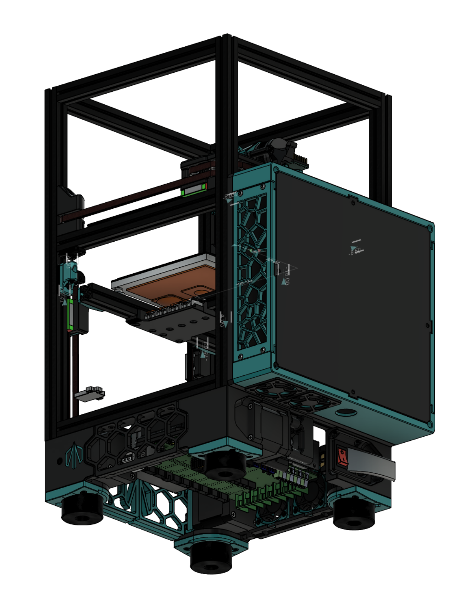

 

  <h3 align="center">Pandora's Box Backpack</h3>

  

## Pandoras_Box_Backpack
Rear mounted electronics housing for Pandora's Box

## General Info
A mod to provide additional space for electronics.

 - BETA status.  CAD File provided for additional modification
 - Electronics mounting bosses not included.  Either use VHB with existing board mounts, or edit model to add bosses for your preferred components

## Suggested BOM
 - 4x M3x40 SHCS screws for corner mounting
 - 20x M3x8 BHCS for assembly
 - 8x M3x20 BHCS for fan mounting
 - 20x M3 Heatset Inserts
 - 2x 4010 Fans

## Acknowledgements

* [MasturMynd - Pandora's Box](https://github.com/MasturMynd/Pandoras_Box)

  

  

